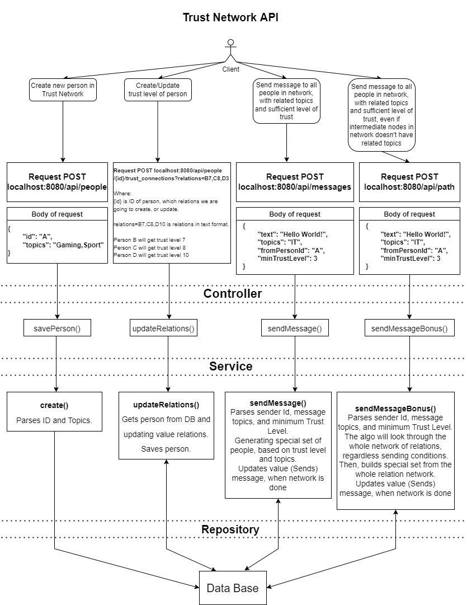
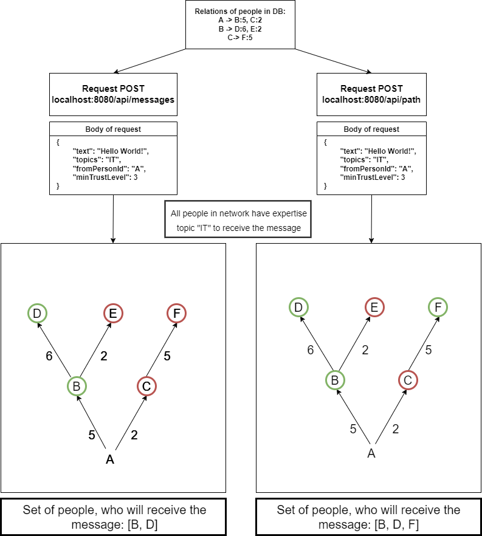

# Trust Network Lightweight REST API

This project was build for DevChallenge XII, backend online round.

I used Sping Boot framework, as a core technology for creating this
social network prototype.

The main topics, that I am going to mention here are:

* Technology stack
* Main features of Trust Network
* Architecture of this project
* Some additional thoughts

## Technology stack

First of all, I want to mention that this project was designed and build
with Java Spring Boot framework.

Full list of additional libraries and useful add-ons:

* Lombok (Was used to construct Pojo methods easily)
* MapStruct(Was used to create mapper for Person -> DTO)

For testing purposes this technologies were used:

* Junit
* H2 Database
* Mockito

Main database used:

* PostgreSQL

# Main features of Trust Network

Trust Network (or TN) was designed to simulate the behavior of
non-trivial social network.

You can create new person here, apply expertise topics for each person
and link some people with trust level, in order to create some network.

Moreover, you can broadcast some messages to people, that have sufficient
level of trust, and has relation links with sender. Also, they should have the topics of the message, as expertise topics.

As an additional feature, there is an opportunity to send messages, that will be broadcasted
to all people in your network (Even through the people who doesn't have the expertise topics as their own)

# Architecture of this project

To clarify the structure of this project, I would like to show this diagram:

Also, to demonstrate the difference between two types of sending the messages:

# Additional thoughts about Trust Network

First of all, I want to mention, that building this application was really fun.

In my opinion, this API could be easily used in bigger social media networks.

The "trust level" could help in targeted advertising, content-filtering, etc.